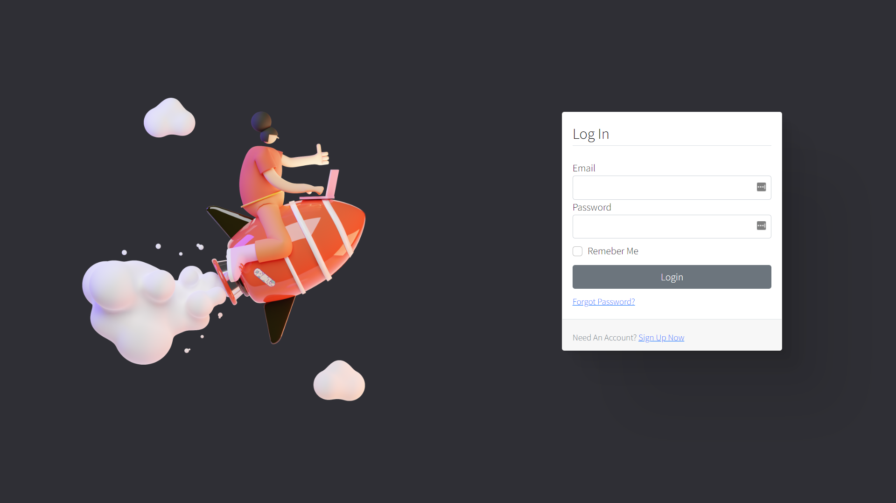

# Sailor - Secure Online Compiler

> This code is submitted to Vmware Campus Hackathon

## High-level System Architecture


## Built With

- Flask (Python based Web Framework)
- Gunicorn (Python WSGI HTTP Server for UNIX)
- Nginx (Web Proxy)
- Supervisord (Process Monitoring)
- Docker (For Sandboxing)
- PostgreSQL (Relational Database for publishing results)
- pgAdmin (Postgres management)
- SQLAlchemy (Object Relational Mapper)
- Alembic (Database Migration Tool)
- Redis (In-memory NoSQL Database used for caching)
- RabbitMQ (Message Broker)
- Celery (Python based Asynchronous Task Queue)
- Flower (Celery Monitoring)
- Bcrypt (Secure password hashing algorithm and module)

## Sailor Screenshots


### Authentication




### Editor Interface


### Terminal Output Streams


### Design Peek-a-boo


## How to run?

The project relies on Docker & Docker Compose!

```
$ docker-compose up -d --scale worker=5
```

Now you can go to http://localhost:5000
